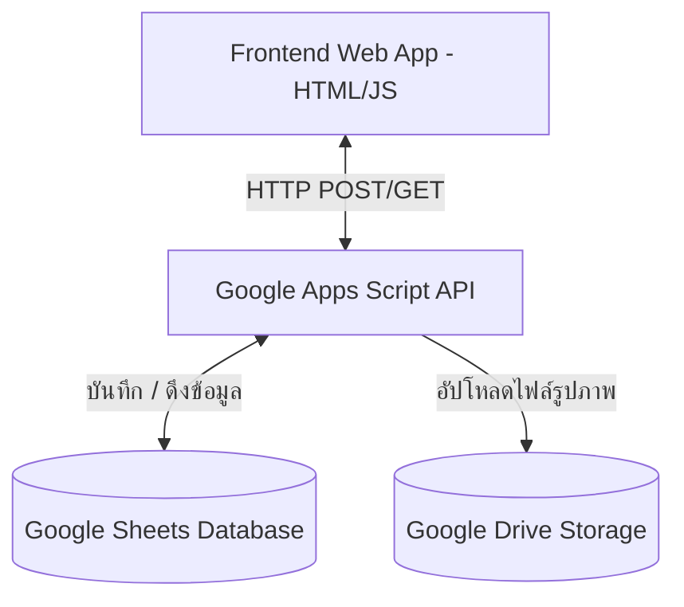

# 🏫 คู่มือการใช้งานและการติดตั้งระบบ MAKHRAB (ระบบจัดการโรงเรียนออนไลน์)
> **สำหรับ: โรงเรียนไชยฉิมพลีวิทยาคม**  
> เอกสารฉบับนี้อธิบายปุ่มกด ขั้นตอนการใช้ เมนู โครงสร้างชีตข้อมูล และขั้นตอนการติดตั้ง Deploy ระบบทั้งหมดอย่างเจาะลึก (Unified Manual)

---

## 📌 สารบัญ (Table of Contents)
1. [ภาพรวมของระบบและโครงสร้างสิทธิ์การใช้งาน](#1-ภาพรวมของระบบและโครงสร้างสิทธิ์การใช้งาน)
2. [การติดตั้งและ Deploy Google Apps Script (Web App)](#2-การติดตั้งและ-deploy-google-apps-script-web-app)
3. [การตั้งค่าโฟลเดอร์ Google Drive Storage](#3-การตั้งค่าโฟลเดอร์-google-drive-storage)
4. [รายละเอียดโครงสร้างฐานข้อมูลแยกรายชีต (Sheets Schema)](#4-รายละเอียดโครงสร้างฐานข้อมูลแยกรายชีต-sheets-schema)
5. [คู่มืออย่างละเอียดสำหรับผู้ดูแลระบบ (Admin User Guide)](#5-คู่มืออย่างละเอียดสำหรับ-ผู้ดูแลระบบ-admin-user-guide)
6. [คู่มืออย่างละเอียดสำหรับครูผู้สอน (Teacher User Guide)](#6-คู่มืออย่างละเอียดสำหรับ-ครูผู้สอน-teacher-user-guide)
7. [คู่มืออย่างละเอียดสำหรับนักเรียน (Student User Guide)](#7-คู่มืออย่างละเอียดสำหรับ-นักเรียน-student-user-guide)
8. [ขั้นตอนทางเทคนิคและการแก้ไขปัญหา (Troubleshooting)](#8-ขั้นตอนทางเทคนิคและการแก้ไขปัญหา-troubleshooting)

---

## 1. ภาพรวมของระบบและโครงสร้างสิทธิ์การใช้งาน

ระบบ **MAKHRAB** เป็นเว็บแอปพลิเคชันหน้าเดียว (Single Page Application - SPA) ที่ถูกออกแบบด้วยสไตล์ **Glassmorphism (กระจกฝ้าโปร่งแสง)** รองรับการใช้งานผ่านคอมพิวเตอร์ แท็บเล็ต และสมาร์ทโฟน โดยระบบจะปรับเปลี่ยนการแสดงผลจากตารางเป็น "การ์ด" (Card View) อัตโนมัติเมื่อใช้งานผ่านมือถือ

### 🔄 แผนผังการทำงานของระบบ (System Architecture)


### 👤 สิทธิ์ผู้ใช้งานในระบบ (User Roles)
ระบบแบ่งผู้ใช้งานออกเป็น 3 กลุ่มหลัก ดังนี้:

| กลุ่มผู้ใช้งาน | หน้าที่หลักในระบบ |
|---|---|
| **ผู้ดูแลระบบ (Admin)** | จัดการข้อมูลพื้นฐานทั้งหมด (วิชา, ครู, ชั้นเรียน, นักเรียน), นำเข้าข้อมูล CSV, เชื่อมโยง Google Sheets |
| **ครูผู้สอน (Teacher)** | เช็คชื่อนักเรียน, บันทึกการเยี่ยมบ้านพร้อมระบุพิกัด GPS/รูปภาพ, สั่งและตรวจการบ้าน, จัดการชุมนุม |
| **นักเรียน (Student)** | เข้าดูสถิติเวลาเรียนและประวัติการส่งงาน, ลงทะเบียนกิจกรรมชุมนุม, บันทึกข้อมูลส่วนตัวของตนเอง |

---

## 2. การติดตั้งและ Deploy Google Apps Script (Web App)

ระบบ MAKHRAB ทำงานแบบ Serverless โดยใช้ Google Sheets เป็นฐานข้อมูลผ่าน API ที่พัฒนาด้วย Google Apps Script หากต้องการติดตั้งใหม่หรืออัปเกรดระบบ ให้ปฏิบัติตามขั้นตอนดังนี้:

### ⚙️ ขั้นตอนการ Deploy Script:

1. **สร้าง Google Sheets ใหม่:** 
   * ล็อกอินบัญชี Google (แนะนำให้ใช้อีเมลส่วนกลางของโรงเรียน)
   * สร้างสเปรดชีตเปล่าขึ้นมา 1 ไฟล์
2. **เปิดตัวแก้ไขสคริปต์ (Apps Script Editor):**
   * ไปที่แถบเมนูหลักด้านบน คลิกที่ **ส่วนขยาย (Extensions)** -> เลือก **Apps Script**
3. **วางโค้ดระบบ:**
   * คัดลอกโค้ดทั้งหมดจากไฟล์ [google_apps_script.js](file:///d:/Makrb/patsakornchamp.github.io/google_apps_script.js) ในโปรเจกต์
   * วางทับลงในหน้าต่างโปรแกรมแก้ไข Apps Script (ในไฟล์ชื่อ `รหัส.gs` หรือ `Code.gs`)
4. **ตั้งค่า Folder ID ของ Google Drive:**
   * แก้ไขตัวแปรบรรทัดที่ 6 ถึง 9 ใน Apps Script ให้เป็น ID ของโฟลเดอร์ Google Drive ของโรงเรียน (ดูวิธีสร้างในหัวข้อถัดไป)
5. **ทำการ Deploy (สร้างเวอร์ชันใช้งานจริง):**
   * คลิกที่ปุ่ม **การทำให้ใช้งานได้ (Deploy)** ที่มุมบนขวา -> เลือก **การจัดการการทำให้ใช้งานได้ใหม่ (New deployment)**
   * ในหน้าต่างตั้งค่า ให้คลิกที่ไอคอนฟันเฟือง (Select type) -> เลือก **เว็บแอป (Web app)**
6. **กำหนดระดับการเข้าถึง (สำคัญมาก):**
   * **คำอธิบาย (Description):** ระบุคำอธิบาย เช่น `MAKHRAB API V2`
   * **เรียกใช้งานในฐานะ (Execute as):** เลือก **ฉัน (อีเมลของคุณ)** 
   * **ผู้มีสิทธิ์เข้าถึง (Who has access):** เลือก **ทุกคน (Anyone)** 
     > [!WARNING]
     > หากไม่เลือกเป็น "ทุกคน (Anyone)" ครูและนักเรียนจะไม่สามารถส่งข้อมูลหรือเชื่อมต่อเข้ากับสคริปต์เพื่อดึงประวัติการเช็คชื่อ/เยี่ยมบ้านได้
7. **ลงทะเบียนและอนุญาตสิทธิ์การใช้งานสคริปต์ (Authorize):**
   * คลิกปุ่ม **การทำให้ใช้งานได้ (Deploy)**
   * ระบบจะแสดงหน้าต่างยืนยันความปลอดภัยเพื่อเข้าถึง Drive และ Google Sheets
   * คลิก **ให้สิทธิ์เข้าถึง (Authorize Access)** -> เลือกบัญชี Google -> คลิก **ขั้นสูง (Advanced)** -> คลิก **ไปที่ [ชื่อโปรเจกต์ของคุณ] (ไม่ปลอดภัย)** -> กด **อนุญาต (Allow)**
8. **คัดลอก URL ของ Web App:**
   * เมื่อสคริปต์ทำการ Deploy สำเร็จ จะแสดง URL ของเว็บแอป (จะลงท้ายด้วย `/exec`) 
   * คัดลอก URL นี้ไว้
9. **เปิดการเข้าใช้งาน Drive ครั้งแรก (First-Time Run):**
   * ในตัวแก้ไขสคริปต์ ให้เลือกฟังก์ชัน `forceAuthDrive` ที่แถบเครื่องมือด้านบน
   * กดปุ่ม **เรียกใช้งาน (Run)** เพื่อทดสอบการสร้างไฟล์จำลองและอนุญาตให้ API สามารถเข้าถึงเขียนไฟล์ลงโฟลเดอร์ Google Drive ได้
10. **ผูกข้อมูลเข้ากับ Frontend:**
    * เปิดไฟล์ [js/core/config.js](file:///d:/Makrb/patsakornchamp.github.io/js/core/config.js) ในเครื่องคอมพิวเตอร์ของคุณ
    * นำ URL ที่คัดลอกมาได้ไปแก้ไขทับตรงตัวแปร `DEFAULT_GOOGLE_SCRIPT_URL` ดังนี้:
      ```javascript
      export const DEFAULT_GOOGLE_SCRIPT_URL = "https://script.google.com/macros/s/ชื่อไอดีสคริปต์ของคุณ/exec";
      ```
    * หรือนำ URL ไปเปลี่ยนภายในหน้าระบบ ผ่านเมนู **"ตั้งค่าเชื่อมต่อ (Settings)"** ของแอดมิน

---

## 3. การตั้งค่าโฟลเดอร์ Google Drive Storage

ระบบ MAKHRAB มีการอัปโหลดไฟล์จริงจากระบบ เช่น ภาพถ่ายเยี่ยมบ้าน ภาพถ่ายโปรไฟล์นักเรียน และไฟล์งาน เพื่อไม่ให้จัดเก็บไฟล์เหล่านี้ลงในเซลล์สเปรดชีตตรงๆ (ซึ่งมีข้อจำกัดด้านขนาด) ระบบจะอัปโหลดภาพขึ้น Google Drive แทน แล้วนำ URL มาบันทึกลงชีต

### 📁 ขั้นตอนการสร้างโฟลเดอร์และตั้งค่า:
1. เปิด **Google Drive** ของบัญชีผู้ใช้ระบบ
2. สร้างโฟลเดอร์หลักขึ้นมา 1 โฟลเดอร์ (เช่น `MAKHRAB_STORAGE`)
3. ดับเบิ้ลคลิกเข้าไป แล้วสร้างโฟลเดอร์ย่อย 4 โฟลเดอร์ ดังนี้:
   * `Student_Profiles` (สำหรับเก็บรูปประจำตัวและรูปถ่ายบ้านของนักเรียน)
   * `Home_Visits` (สำหรับเก็บรูปถ่ายเยี่ยมบ้านและลายเซ็นผู้ปกครอง)
   * `Assignments` (สำหรับเก็บไฟล์เอกสาร/ใบงานที่ครูสั่งการบ้าน)
   * `Submissions` (สำหรับเก็บไฟล์งานที่นักเรียนแนบส่งคืนครู)
4. **ตั้งค่าการแชร์โฟลเดอร์ (สำคัญมาก):**
   * คลิกขวาที่โฟลเดอร์ย่อยแต่ละอัน -> เลือก **แชร์ (Share)**
   * ปรับการเข้าถึงทั่วไป (General Access) จาก "จำกัด (Restricted)" เป็น **"ทุกคนที่มีลิงก์ (Anyone with the link)"** และตั้งระดับสิทธิ์เป็น **"ผู้มีสิทธิ์อ่าน (Viewer)"** เท่านั้น
     > [!IMPORTANT]
     > หากไม่เปลี่ยนสิทธิ์การแชร์ของโฟลเดอร์เป็น "ทุกคนที่มีลิงก์" หน้าเว็บหลักจะไม่สามารถดึงภาพโปรไฟล์หรือรูปภาพเยี่ยมบ้านมาแสดงผลได้ และรายงาน PDF จะแสดงรูปเป็นช่องว่าง
5. คัดลอก ID ของแต่ละโฟลเดอร์จากแถบที่อยู่เว็บ (URL) ด้านบน (ตัวอย่าง: `https://drive.google.com/drive/folders/1c3wsOu1...` -> ส่วนสีแดงคือ Folder ID)
6. นำ ID ไปใส่ในไฟล์สคริปต์ Apps Script บรรทัดที่ 6 ถึง 9:
   ```javascript
   const DRIVE_FOLDER_STUDENT_PROFILES = "ใส่ไอดีโฟลเดอร์ย่อย Student_Profiles ตรงนี้";
   const DRIVE_FOLDER_HOME_VISIT = "ใส่ไอดีโฟลเดอร์ย่อย Home_Visits ตรงนี้";
   const DRIVE_FOLDER_ASSIGNMENTS = "ใส่ไอดีโฟลเดอร์ย่อย Assignments ตรงนี้";
   const DRIVE_FOLDER_SUBMISSIONS = "ใส่ไอดีโฟลเดอร์ย่อย Submissions ตรงนี้";
   ```

---

## 4. รายละเอียดโครงสร้างฐานข้อมูลแยกรายชีต (Sheets Schema)

นี่คือรายละเอียดและประเภทข้อมูล (Data Types) ของแต่ละคอลัมน์ในแต่ละแผ่นงานใน Google Sheets ทั้งหมด 13 ชีตหลัก:

### 4.1 ชีต `Students` (ตารางข้อมูลนักเรียน)
ใช้เก็บรายละเอียดโปรไฟล์ ประวัติการติดต่อ และพิกัดบ้านของนักเรียน

| ชื่อคอลัมน์ | ประเภทข้อมูล | คำอธิบาย |
|---|---|---|
| `id` | String (UUID) | คีย์หลัก (Primary Key) ประจำตัวนักเรียน |
| `studentId` | String | รหัสประจำตัวนักเรียน 5 หลัก (เช่น `12345`) |
| `title` | String | คำนำหน้าชื่อ (`เด็กชาย` / `เด็กหญิง` / `นาย` / `นางสาว`) |
| `firstName` | String | ชื่อจริงนักเรียน |
| `lastName` | String | นามสกุลนักเรียน |
| `nickname` | String | ชื่อเล่น |
| `class` | String | ระดับห้องเรียนปัจจุบัน (เช่น `ม.1/1`) |
| `number` | Number | เลขที่ในห้องเรียน |
| `citizenId` | String | เลขประจำตัวประชาชน 13 หลัก |
| `dob` | Date (YYYY-MM-DD) | วันเกิดนักเรียน |
| `phone` | String | เบอร์โทรศัพท์มือถือส่วนตัว |
| `email` | String | อีเมล |
| `address` | String | ที่อยู่ตามทะเบียนบ้าน |
| `profileImageUrl` | String (URL) | ลิงก์รูปภาพถ่ายโปรไฟล์บน Google Drive |
| `status` | String | สถานะภาพนักเรียน (`ปกติ` / `ลาออก`) |
| `homeVisit` | String | สถานะการเยี่ยมบ้านล่าสุด |
| `isProfileComplete` | String | บ่งบอกว่านักเรียนมากรอกข้อมูลครบหรือยัง (`true` / `false`) |
| `parentTitle` | String | คำนำหน้าผู้ปกครองหลัก |
| `parentFirstName` | String | ชื่อจริงผู้ปกครองหลัก |
| `parentLastName` | String | นามสกุลผู้ปกครองหลัก |
| `parentRelation` | String | ความสัมพันธ์กับนักเรียน (เช่น `บิดา`, `มารดา`, `ป้า`) |
| `parentPhone` | String | เบอร์โทรศัพท์ติดต่อผู้ปกครองหลัก |
| `fatherFirstName` | String | ชื่อจริงของบิดา |
| `fatherLastName` | String | นามสกุลของบิดา |
| `fatherAge` | String | อายุของบิดา |
| `fatherJob` | String | อาชีพของบิดา |
| `fatherPhone` | String | เบอร์โทรศัพท์บิดา |
| `motherFirstName` | String | ชื่อจริงของมารดา |
| `motherLastName` | String | นามสกุลของมารดา |
| `motherAge` | String | อายุของมารดา |
| `motherJob` | String | อาชีพของมารดา |
| `motherPhone` | String | เบอร์โทรศัพท์มารดา |
| `home_latitude` | String | ละติจูดพิกัดที่ตั้งบ้านนักเรียน |
| `home_longitude` | String | ลองจิจูดพิกัดที่ตั้งบ้านนักเรียน |
| `home_directions` | String | แผนที่การเดินทางหรือคำอธิบายทางไปบ้านนักเรียน |
| `home_photo_1_url` | String (URL) | ลิงก์ภาพถ่ายที่พักภายนอกบ้านนักเรียน |
| `home_photo_2_url` | String (URL) | ลิงก์ภาพถ่ายภายในบ้านนักเรียน |
| `home_photo_3_url` | String (URL) | ลิงก์ภาพถ่ายบ้านมุมอื่นๆ |
| `deleted_flg` | String (`N`/`Y`) | แฟล็กใช้สำหรับระบุสถานะลบข้อมูลแบบนุ่มนวล |

---

### 4.2 ชีต `Records` (ตารางบันทึกการเช็คชื่อปกติ)
ใช้เก็บประวัติเข้าเรียนของชั้นเรียนปกติและรายวิชาต่างๆ

| ชื่อคอลัมน์ | ประเภทข้อมูล | คำอธิบาย |
|---|---|---|
| `id` | String | ไอดีประวัติคาบเช็คชื่อเรียน |
| `date` | Date (YYYY-MM-DD) | วันที่เช็คชื่อ |
| `year` | String | ปีการศึกษา (เช่น `2567`) |
| `semester` | String | ภาคการศึกษา (`1` หรือ `2`) |
| `period` | String | คาบเรียนที่ลงประวัติ (เช่น `โฮมรูม`, `1`, `พักเที่ยง`) |
| `classId` | String | รหัสห้องเรียนของชั้นเรียน (อ้างอิง `Classes.id`) |
| `subjectId` | String | รหัสวิชาที่มีการสอน (อ้างอิง `Subjects.id`) |
| `teacherId` | String | รหัสประวัติผู้เช็คชื่อ (อ้างอิง `Teachers.id`) |
| `attendance` | JSON String (Array) | รายชื่อสถานะเด็ก เช่น `[{"studentId":"...","status":"มา"}]` |
| `deleted_flg` | String (`N`/`Y`) | สถานะยกเลิกประวัติคาบเรียน |

---

### 4.3 ชีต `Subjects` (ตารางรายวิชาเรียน)
เก็บรายละเอียดของวิชาที่เปิดสอน

| ชื่อคอลัมน์ | ประเภทข้อมูล | คำอธิบาย |
|---|---|---|
| `id` | String | คีย์หลักของวิชา |
| `code` | String | รหัสวิชา (เช่น `ท21101`) |
| `name` | String | ชื่อวิชา (เช่น `ภาษาไทย 1`) |
| `credit` | Number / String | จำนวนหน่วยกิตวิชา (เช่น `1.5`) |
| `deleted_flg` | String (`N`/`Y`) | แฟล็กเช็คการถูกลบวิชาออกจากระบบ |

---

### 4.4 ชีต `Teachers` (ตารางประวัติครูผู้สอน)
เก็บข้อมูลประวัติครูและสิทธิ์วิชาการสอน

| ชื่อคอลัมน์ | ประเภทข้อมูล | คำอธิบาย |
|---|---|---|
| `id` | String | คีย์หลักประจำตัวครู |
| `teacherId` | String | รหัสประจำตัวครู (สำหรับล็อกอิน) |
| `title` | String | คำนำหน้าชื่อครู |
| `firstName` | String | ชื่อจริงของครู |
| `lastName` | String | นามสกุลของครู |
| `email` | String | อีเมลล็อกอินครู |
| `password` | String | รหัสผ่านการล็อกอินเข้าระบบ |
| `subjects` | JSON String (Array) | ลิสต์ ID วิชาที่ครูมีสิทธิ์สอน เช่น `["sub1_id","sub2_id"]` |
| `deleted_flg` | String (`N`/`Y`) | แฟล็กแสดงการปิดใช้งานสิทธิ์ครู |

---

### 4.5 ชีต `Classes` (ตารางประวัติห้องเรียน)
เก็บข้อมูลและคุณลักษณะห้องเรียนในแต่ละภาคการศึกษา

| ชื่อคอลัมน์ | ประเภทข้อมูล | คำอธิบาย |
|---|---|---|
| `id` | String | คีย์หลักห้องเรียน |
| `year` | String | ปีการศึกษา |
| `semester` | String | ภาคการศึกษา |
| `className` | String | ชื่อชั้นเรียนย่อ (เช่น `ม.3/2`) |
| `advisors` | JSON String (Array) | รหัส ID ของครูที่ปรึกษาประจำห้องเรียนนี้ |
| `subjects` | JSON String (Array) | รายการ ID วิชาทั้งหมดที่ห้องนี้ต้องเข้าเรียน |
| `deleted_flg` | String (`N`/`Y`) | แฟล็กยกเลิกการแสดงผลห้องเรียน |

---

### 4.6 ชีต `Clubs` (ตารางกลุ่มกิจกรรมชุมนุม)
ข้อมูลชุมนุมที่มีสิทธิ์ให้นักเรียนเลือกสมัครลงทะเบียน

| ชื่อคอลัมน์ | ประเภทข้อมูล | คำอธิบาย |
|---|---|---|
| `id` | String | คีย์หลักกิจกรรมชุมนุม |
| `year` | String | ปีการศึกษา |
| `semester` | String | ภาคเรียน |
| `name` | String | ชื่อชุมนุม |
| `capacity` | Number | จำนวนโควตานักเรียนที่รับสมัครสูงสุด |
| `teacherId` | String | ครูผู้สอนหลักที่จัดกิจกรรมและรับผิดชอบเช็คชื่อ |
| `deleted_flg` | String (`N`/`Y`) | แฟล็กปิดการใช้งานชุมนุม |

---

### 4.7 ชีต `ClubEnrollments` (ตารางการลงทะเบียนชุมนุม)
ประวัติบันทึกการสมัครลงทะเบียนเพื่อจับคู่ความสัมพันธ์นักเรียนกับชุมนุม

| ชื่อคอลัมน์ | ประเภทข้อมูล | คำอธิบาย |
|---|---|---|
| `id` | String | คีย์หลักประวัติการลงทะเบียน |
| `year` | String | ปีการศึกษาการเรียน |
| `semester` | String | ภาคการเรียน |
| `clubId` | String | รหัสชุมนุมที่เลือกเรียน (อ้างอิง `Clubs.id`) |
| `studentId` | String | รหัสนักเรียนผู้สมัครลงทะเบียน (อ้างอิง `Students.id`) |
| `deleted_flg` | String (`N`/`Y`) | แฟล็กยกเลิกการลงทะเบียน |

---

### 4.8 ชีต `ClubRecords` (ตารางประวัติเวลาเช็คชื่อชุมนุม)
ประวัติบันทึกกิจกรรมและการเข้าเช็คชื่อการเรียนชุมนุมย้อนหลัง

| ชื่อคอลัมน์ | ประเภทข้อมูล | คำอธิบาย |
|---|---|---|
| `id` | String | คีย์หลักบันทึกคาบชุมนุม |
| `clubId` | String | รหัสชุมนุม (อ้างอิง `Clubs.id`) |
| `date` | Date | วันที่ลงกิจกรรมเช็คชื่อชุมนุม |
| `attendance` | JSON String (Array) | ประวัติเข้าเรียน เช่น `[{"studentId":"...","status":"มา"}]` |
| `deleted_flg` | String (`N`/`Y`) | แฟล็กยกเลิกประวัติคาบกิจกรรม |

---

### 4.9 ชีต `Assignments` (ตารางรายละเอียดการบ้าน)
ใช้บันทึกชิ้นงาน/การบ้านประจำวิชาที่ครูผู้สอนเป็นผู้โพสต์สั่ง

| ชื่อคอลัมน์ | ประเภทข้อมูล | คำอธิบาย |
|---|---|---|
| `id` | String | รหัสหัวข้อใบงานสั่ง |
| `classId` | String | รหัสชั้นเรียนที่สั่งงาน (อ้างอิง `Classes.id`) |
| `subjectId` | String | รหัสวิชาที่สั่งงาน (อ้างอิง `Subjects.id`) |
| `teacherId` | String | รหัสครูผู้สั่งงาน (อ้างอิง `Teachers.id`) |
| `title` | String | หัวข้องานหลัก (เช่น `ใบงานสรุปเนื้อหาบทที่ 1`) |
| `description` | String | รายละเอียดชิ้นงาน เกณฑ์ คำแนะนำเพิ่มเติม |
| `maxPoints` | Number | คะแนนเต็มประจำชิ้นงานนี้ |
| `dueDate` | Date (YYYY-MM-DD) | วันเวลากำหนดส่งวันสุดท้าย |
| `files` | JSON String (Array) | ลิสต์ไฟล์สื่อแนบประกอบใบงานของครู `[{"n":"filename","u":"url"}]` |
| `deleted_flg` | String (`N`/`Y`) | แฟล็กยกเลิก/ลบการบ้านชิ้นนี้ออกจากระบบ |

---

### 4.10 ชีต `StudentAssignments` (ตารางการส่งการบ้านของนักเรียน)
บันทึกประวัติการส่งงาน แนบลิงก์ผลงาน และคะแนนที่ครูผู้สอนให้

| ชื่อคอลัมน์ | ประเภทข้อมูล | คำอธิบาย |
|---|---|---|
| `id` | String | คีย์ประวัติส่งงานเดี่ยว (ใช้: `assignmentId_studentId`) |
| `assignmentId` | String | รหัสวิชาการบ้านที่สั่ง (อ้างอิง `Assignments.id`) |
| `studentId` | String | รหัสตัวตนนักเรียนผู้ส่งงาน (อ้างอิง `Students.id`) |
| `submissionText` | String | ข้อความพิมพ์คำอธิบายประกอบการส่งงาน |
| `files` | JSON String (Array) | ลิสต์ไฟล์งานที่เด็กอัปโหลดแนบส่งคืนครู `[{"n":"filename","u":"url"}]` |
| `submittedAt` | Date/Timestamp | วันเวลาที่กดยืนยันการส่งงานสำเร็จ |
| `score` | Number / String | คะแนนที่ครูให้ (เว้นว่างไว้คือรอกรอกคะแนนตรวจ) |
| `teacherFeedback` | String | คอมเมนต์แนะแนวหรือข้อเสนอแนะเพิ่มจากครูผู้สอน |
| `gradedAt` | Date/Timestamp | วันและเวลาที่ครูผู้สอนให้คะแนน |
| `gradedBy` | String | ID ผู้ประเมินให้คะแนน |
| `deleted_flg` | String (`N`/`Y`) | แฟล็กยกเลิกการส่งชิ้นงาน |

---

### 4.11 ชีต `Home_Visits` (ตารางรายงานเยี่ยมบ้านหลัก)
เก็บข้อมูลประวัติการเยี่ยมบ้าน 22 คอลัมน์มาตรฐาน

| ชื่อคอลัมน์ | ประเภทข้อมูล | คำอธิบาย |
|---|---|---|
| `visit_id` | String | รหัสการเยี่ยมบ้าน (ใช้: `studentId_year_semester`) |
| `student_id` | String | รหัสนักเรียนที่ถูกเยี่ยมบ้าน (อ้างอิง `Students.id`) |
| `academic_year` | String | ปีการศึกษาที่มีการลงพื้นที่เยี่ยมบ้าน |
| `semester` | String | ภาคการศึกษาที่บันทึกข้อมูล |
| `visit_date` | Date (YYYY-MM-DD) | วันที่ครูผู้สอนและทีมงานเยี่ยมบ้านนักเรียนจริง |
| `guardian_name` | String | ชื่อ-สกุลผู้ปกครองที่ให้ข้อมูลการเยี่ยมบ้าน |
| `guardian_relationship`| String | ความสัมพันธ์กับตัวเด็ก (เช่น `ปู่`, `อา`) |
| `guardian_phone` | String | เบอร์ติดต่อผู้ปกครองที่ให้ข้อมูล |
| `housing_type` | String | สภาพที่อยู่อาศัย (เช่น `บ้านส่วนตัว`, `แฟลตตำรวจ`) |
| `economic_status` | String | สรุปฐานะทางการเงินครอบครัว (`ขัดสน`, `ปานกลาง`, `ดี`) |
| `environment_safety` | String | สภาพแวดล้อมที่ตั้งของบ้านนักเรียน |
| `commute_method` | String | การเดินทางมาเรียนของเด็ก (เช่น `เดิน`, `มอเตอร์ไซค์`) |
| `home_behavior` | String | พฤติกรรมทั่วไปของนักเรียนขณะอยู่บ้านตามรายงานปกครอง |
| `watchlist_issues` | String (Comma Sep) | รายการประเด็นเฝ้าระวังความประพฤติ (เช่น `ยาเสพติด,ติดเกม`) |
| `guardian_suggestions` | String | ความคาดหวังหรือคำเสนอแนะจากผู้ปกครองที่มีต่อโรงเรียน |
| `photo_1_url` | String (URL) | ลิงก์รูปถ่ายพิกัดด้านนอกตัวบ้าน |
| `photo_2_url` | String (URL) | ลิงก์รูปถ่ายครูเยี่ยมบ้านร่วมกับผู้ปกครองและนักเรียน |
| `photo_3_url` | String (URL) | ลิงก์รูปถ่ายพิกัดภายใน/มุมที่นั่งทำการบ้าน |
| `latitude` | String | ละติจูดพิกัดบ้าน (จากการดึงพิกัด GPS บนมือถือครู) |
| `longitude` | String | ลองจิจูดพิกัดบ้าน |
| `updated_by` | String | รหัส ID บัญชีครูผู้เข้ามาเขียน/บันทึกรายงานเยี่ยมบ้าน |
| `timestamp` | Date/Timestamp | วันเวลาของระบบที่บันทึกการทำธุรกรรม |
| `signature_url` | String (URL) | ลิงก์ภาพลายเซ็น (Signature) ของผู้ปกครองที่เซ็นกำกับบนมือถือครู |

---

### 4.12 ชีต `Home_Visit_Members` (ตารางข้อมูลสมาชิกในครอบครัว)
เก็บรายชื่อสมาชิกในบ้านของนักเรียนเพิ่มเติม เพื่อช่วยสนับสนุนรายงานเยี่ยมบ้าน (ความสัมพันธ์แบบ One-to-Many กับชีต `Home_Visits`)

| ชื่อคอลัมน์ | ประเภทข้อมูล | คำอธิบาย |
|---|---|---|
| `id` | String | คีย์หลักของแถวข้อมูลสมาชิก |
| `visit_id` | String | รหัสเชื่อมโยงกับชีตหลัก (อ้างอิง `Home_Visits.visit_id`) |
| `title` | String | คำนำหน้าชื่อสมาชิก (เช่น `นาย`, `ด.ช.`) |
| `first_name` | String | ชื่อจริงสมาชิกในครอบครัว |
| `last_name` | String | นามสกุลสมาชิกในครอบครัว |
| `age` | String / Number | อายุของสมาชิก |
| `occupation` | String | อาชีพการงานของสมาชิกในครอบครัว |
| `relationship` | String | ความสัมพันธ์กับตัวนักเรียน (เช่น `พี่สาว`, `ลุง`) |
| `phone` | String | เบอร์โทรศัพท์ |
| `note` | String | บันทึกรายละเอียดปลีกย่อยเพิ่มเติม |

---

### 4.13 ชีต `PR_News` (ตารางข่าวสารประชาสัมพันธ์)
แสดงกิจกรรมและป้ายประกาศข่าวสารถึงนักเรียนและครูที่หน้าแรก

| ชื่อคอลัมน์ | ประเภทข้อมูล | คำอธิบาย |
|---|---|---|
| `id` | String | คีย์หลักประกาศประชาสัมพันธ์ |
| `activity_name` | String | หัวข้อหลักกิจกรรม |
| `details` | String | คำอธิบายกิจกรรม กำหนดการ กฎเกณฑ์ |
| `start_date` | Date | วันที่เริ่มต้นแสดงประกาศ |
| `end_date` | Date | วันสิ้นสุดของกิจกรรม |
| `image_url` | String (URL) | รูปโปสเตอร์ประชาสัมพันธ์ |
| `status_active` | String (`true`/`false`)| กำหนดสิทธิ์ให้โชว์ที่หน้าประกาศหลักหรือไม่ |
| `note` | String | หมายเหตุภายในของผู้จัดทำ |
| `deleted_flg` | String (`N`/`Y`) | แฟล็กบันทึกการลบแบบนุ่มนวล |

---

## 5. คู่มืออย่างละเอียดสำหรับผู้ดูแลระบบ (Admin User Guide)

ผู้ดูแลระบบมีหน้าที่ดูแลโครงสร้างข้อมูลทั้งหมดเพื่อให้ครูและนักเรียนสามารถเข้าใช้งานระบบได้

### 5.1 เมนู "ข้อมูลพื้นฐาน (Master Data)"
ใช้จัดการข้อมูลดิบทั้งหมดของโรงเรียน แบ่งออกเป็นแท็บย่อยดังนี้:

#### A. แท็บ "จัดการวิชา" (Subjects Tab)
*   **ปุ่ม `เพิ่มวิชา`:** กดเพื่อเปิด Modal สำหรับกรอกข้อมูลวิชาใหม่
    *   *ช่องข้อมูล:* รหัสวิชา, ชื่อวิชา, น้ำหนักหน่วยกิต
    *   *ปุ่ม `บันทึก`:* เพื่อบันทึกลงฐานข้อมูล local
*   **ปุ่ม `แก้ไข` (ไอคอนดินสอสีฟ้า):** อยู่ท้ายแถวของวิชานั้นๆ ใช้กดเปิด Modal แก้ไขข้อมูลวิชาเดิม
*   **ปุ่ม `ลบ` (ไอคอนถังขยะสีแดง):** ใช้กดส่งสัญญาณลบวิชา (Soft Delete ตั้งสถานะเป็นลบแต่ข้อมูลยังอยู่)

#### B. แท็บ "จัดการครูผู้สอน" (Teachers Tab)
*   **ปุ่ม `เพิ่มครูผู้สอน`:** เปิดหน้าต่างบันทึกครูท่านใหม่
    *   *ช่องข้อมูล:* รหัสประจำตัวครู, คำนำหน้า, ชื่อ, นามสกุล, อีเมล (ใช้ล็อกอิน), รหัสผ่าน, และรายการวิชาที่ครูท่านนี้รับผิดชอบสอน
    *   *ปุ่ม `บันทึก`:* ยืนยันบันทึกข้อมูลครู
*   **ปุ่ม `แก้ไข` (ไอคอนดินสอสีฟ้า):** แก้ไขประวัติครู ข้อมูลล็อกอิน และวิชาที่รับผิดชอบ
*   **ปุ่ม `ลบ` (ไอคอนถังขยะสีแดง):** ยกเลิกและลบบัญชีครูท่านนั้น

#### C. แท็บ "จัดการชั้นเรียน" (Classes Tab)
*   **ปุ่ม `เพิ่มชั้นเรียน`:** เปิด Modal บันทึกห้องเรียน
    *   *ช่องข้อมูล:* ปีการศึกษา (พ.ศ.), ภาคเรียน (1 หรือ 2), ชื่อชั้นเรียน (เช่น ม.1/1), ครูที่ปรึกษา (สามารถเลือกครูร่วมกันได้หลายท่าน), รายวิชาทั้งหมดที่เรียนในห้องนี้
    *   *ปุ่ม `บันทึก`:* บันทึกห้องเรียน
*   **ปุ่ม `แก้ไข` / `ลบ` (ปุ่มเครื่องมือท้ายแถว):** จัดการชั้นเรียน ครูที่ปรึกษา และวิชาที่มีสิทธิ์เช็คชื่อประจำห้อง

#### D. แท็บ "จัดการนักเรียน" (Students Tab)
*   **ปุ่ม `เพิ่มนักเรียน`:** บันทึกข้อมูลนักเรียนรายคน
    *   *ช่องข้อมูล:* รหัสประจำตัวนักเรียน, คำนำหน้า, ชื่อ, นามสกุล, ชื่อเล่น, ชั้นเรียน, เลขที่, เลขประจำตัวประชาชน (13 หลัก), วันเกิด, เบอร์โทรศัพท์, อีเมล, ที่อยู่, ข้อมูลพ่อแม่และผู้ปกครอง
*   **ปุ่ม `นำเข้า CSV (Upload CSV)`:** 
    *   ใช้สำหรับอัปโหลดรายชื่อนักเรียนครั้งละทั้งโรงเรียนหรือทั้งห้องเรียน
    *   หลังจากคลิกเลือกไฟล์ระบบจะพรีวิวข้อมูลในตารางให้ตรวจเช็คก่อนกดยืนยัน

---

## 6. คู่มืออย่างละเอียดสำหรับครูผู้สอน (Teacher User Guide)

ครูผู้สอนจะเน้นใช้งาน 6 เมนูการจัดกระบวนการเรียนการสอนและดูแลนักเรียนดังนี้:

### 6.1 เมนู "เช็คชื่อปกติ" (Student Attendance)
ใช้บันทึกเวลาเรียนประจำวัน/รายคาบของนักเรียน:
1.  **ตัวเลือกการกรองข้อมูล (Filter Dropdowns):**
    *   `ปีการศึกษา` และ `ภาคเรียน` (ระบบจะดึงค่าเทอมปัจจุบันให้อัตโนมัติ)
    *   `ครูผู้สอน`: เลือกชื่อครูผู้สอน (หากครูล็อกอินระบบจะเลือกให้ทันที)
    *   `ชั้นเรียน`: เลือกห้องเรียนที่ต้องการเช็คชื่อ
    *   `วิชา`: เลือกรายวิชาที่สอนในห้องนั้น
    *   `คาบเรียน`: เลือกคาบโฮมรูม, คาบ 1 - 8, พักเที่ยง หรือ คิจกรรม
    *   `วันที่เช็คชื่อ`: เลือกวันที่ลงเวลาเรียน (เป็นปฏิทิน เลือกวันนี้โดยอัตโนมัติ)
2.  **ปุ่มควบคุมหลัก:**
    *   **ปุ่ม `ดึงรายชื่อนักเรียน`:** กดเพื่อโหลดตารางรายชื่อนักเรียนตามชั้นเรียนที่เลือก
    *   **ปุ่ม `เช็คชื่อทั้งหมดเป็น มา` (ไอคอนติ๊กถูกสีเขียว):** ใช้เปลี่ยนสถานะนักเรียนทุกคนในห้องให้เป็น **"มา"** ทันทีในคลิกเดียวเพื่อช่วยประหยัดเวลา
    *   **ตัวเลือก `ซ่อนนักเรียนที่เช็คชื่อแล้ว` (Checkbox):** ติ๊กเพื่อกรองเฉพาะรายชื่อนักเรียนที่ค้างเช็คชื่อ
3.  **ตารางเช็ครายบุคคล:**
    *   มีปุ่มเรดิโอตัวเลือกขนาดใหญ่แยกสีชัดเจนให้ครูแตะเลือกทีละคน: **`มา` (เขียว) | `สาย` (เหลือง) | `ลา` (น้ำเงิน) | `ขาด` (แดง)**
4.  **ปุ่มยืนยันด้านล่างสุด:**
    *   **ปุ่ม `บันทึกข้อมูลการเช็คชื่อ` (สีเขียว):** ใช้กดยืนยันการบันทึกสถานะเวลาเรียนทั้งหมดลงเครื่องและพร้อมซิงค์

---

### 6.2 เมนู "เช็คชื่อชุมนุม" (Club Attendance)
ใช้ลงเวลาเข้าร่วมกิจกรรมพัฒนาผู้เรียน/กิจกรรมชุมนุม:
1.  **ตัวเลือกการกรองข้อมูล:**
    *   `ปีการศึกษา` และ `ภาคเรียน`
    *   `เลือกชุมนุม`: เลือกรายชื่อชุมนุมที่ครูรับผิดชอบดูแล
    *   `วันที่เช็คชื่อ`: กำหนดวันจัดกิจกรรมชุมนุม
2.  **ปุ่มดำเนินการ:**
    *   **ปุ่ม `ดึงรายชื่อนักเรียน`:** โหลดเฉพาะรายชื่อนักเรียนที่ลงทะเบียนเรียนในชุมนุมนั้น
    *   **ปุ่ม `เช็คชื่อทั้งหมดเป็น เข้าร่วม`:** ติ๊กทุกคนว่าเข้าร่วมในครั้งเดียว
3.  **ปุ่มยืนยันด้านล่างสุด:**
    *   **ปุ่ม `บันทึกเช็คชื่อกิจกรรมชุมนุม`:** กดเพื่อบันทึกประวัติกิจกรรม

---

### 6.3 เมนู "ประวัติเข้าเรียน" (Attendance History)
ใช้สำหรับค้นหา ตรวจสอบ หรือแก้ไขประวัติเช็คชื่อย้อนหลัง:
1.  **ตัวกรองประวัติ:**
    *   เลือกว่าจะดูประวัติของ **"เช็คชื่อปกติ"** หรือ **"เช็คชื่อกิจกรรมชุมนุม"**
    *   กำหนด `วันที่`, `ชั้นเรียน/ชุมนุม`, และ `วิชา` ที่ต้องการค้นหา
2.  **ปุ่ม `ค้นหาประวัติ`:** เมื่อกดแล้ว ระบบจะดึงประวัติที่มีข้อมูลบันทึกในฐานข้อมูลขึ้นมาแสดง
3.  **ตารางพรีวิวผล:**
    *   ระบบจะแสดงวันที่, คาบเรียน, รายวิชา, สรุปจำนวนยอดรวม (มา/สาย/ลา/ขาด) ของห้องเรียนนั้น
4.  **ปุ่มในแถบตารางประวัติ:**
    *   **ปุ่ม `ดูข้อมูลอย่างละเอียด` (ไอคอนตา):** ใช้ตรวจสอบรายบุคคลว่าเด็กคนไหนได้สถานะอะไรในประวัตินั้นๆ
    *   **ปุ่ม `แก้ไขข้อมูล` (ไอคอนดินสอ):** สำหรับครูผู้สอนเพื่อขอเปลี่ยนสถานะเช็คชื่อย้อนหลังหากบันทึกผิดพลาด
    *   **ปุ่ม `ลบประวัติการเช็คชื่อ` (ไอคอนถังขยะ):** ลบประวัติคาบนั้นทิ้ง (Soft Delete)

---

### 6.4 เมนู "สถิติ" (Attendance Statistics)
ใช้สรุปวิเคราะห์เวลาเรียนเพื่อส่งต่อข้อมูลให้ฝ่ายปกครองหรือส่งผลการเข้าเรียนประกอบเกรดเฉลี่ย:
1.  **ตัวกรองรายงาน:** เลือกปีการศึกษา, ชั้นเรียน, และวิชา (หรือเลือก **"รวมทุกวิชา"** เพื่อดูสถิติรวม)
2.  **ปุ่ม `ดึงข้อมูลสถิติ`:** คำนวณร้อยละการมาเรียน
3.  **ปุ่ม `ส่งออกข้อมูล (Export to Excel)`:** ดาวน์โหลดสรุปเวลาเรียนของนักเรียนทั้งห้องออกมาเป็นไฟล์ Excel (.xlsx) ทันที
4.  **ตารางแสดงผลสถิติ:**
    *   สรุปจำนวนครั้งแยกตามหัวข้อ (มา, สาย, ลา, ขาด) และคำนวณ **เปอร์เซ็นต์เวลาเรียนเข้าเรียน (%)** สีป้ายกำกับจะแสดงสีแดงหากเวลาเรียนต่ำกว่า 80% (ไม่มีสิทธิ์สอบ)

---

### 6.5 เมนู "เยี่ยมบ้าน" (Home Visit Portal)
หน้าต่างหลักสำหรับครูที่ปรึกษาลงพื้นที่เยี่ยมบ้านนักเรียน:
1.  **ตัวกรองรายชื่อ:** เลือก `ชั้นเรียนที่ท่านเป็นที่ปรึกษา` และกดปุ่ม **`ค้นหา`**
2.  **ตารางสรุปนักเรียนที่ปรึกษา:**
    *   แสดงเลขที่ ชื่อ เบอร์ติดต่อ และสรุปข้อมูลผู้ปกครอง
    *   **ปุ่ม `พิกัด/รูปบ้าน` (ปุ่มสีน้ำเงิน):** เปิดพรีวิวดูพิกัด GPS และรูปถ่ายบ้าน 3 รูปที่เด็กอัปโหลดไว้ล่วงหน้า
    *   **ดรอปดาวน์เลือกสถานะย่อ:** เปลี่ยนสถานะเยี่ยมบ้านด่วนได้ เช่น **สำเร็จ, ยังไม่เยี่ยม, เลื่อนวันเข้าเยี่ยม, ไม่พบผู้ปกครอง**
    *   **ปุ่ม `บันทึก` (ปุ่มสีฟ้า):** เปิดหน้าฟอร์มบันทึกการเยี่ยมบ้านแบบทีละขั้น (5 Steps Form)
    *   **ปุ่ม `รายงาน` (ปุ่มสีเขียว - แสดงเมื่อเยี่ยมสำเร็จ):** เปิดพิมพ์หน้ารายงานเดี่ยวทันที
3.  **รายละเอียดปุ่มกดใน Modal เยี่ยมบ้าน (5 Steps):**
    *   **ปุ่ม `คัดลอกข้อมูลผู้ปกครองจากฐานข้อมูล`:** ดึงข้อมูลบิดาหรือมารดาจากตารางประวัติเด็กมาใส่ในช่องข้อมูลผู้ปกครองปัจจุบันทันทีโดยไม่ต้องพิมพ์ซ้ำ
    *   **ปุ่ม `ดึงพิกัดปัจจุบัน`:** ใช้สำหรับจับพิกัดบ้านด้วยอุปกรณ์มือถือของครูขณะยืนอยู่ที่หน้าบ้านนักเรียนจริง
    *   **ปุ่ม `ล้างลายมือชื่อ`:** เคลียร์ลายเซ็นบน Canvas เพื่อลงนามลายเซ็นใหม่
    *   **ปุ่ม `แก้ไขข้อมูล (เปิดโหมดแก้ไข)`:** ปลดล็อกฟิลด์ทุกช่องให้แก้ไขได้ (กรณีมีบันทึกเก่าอยู่แล้ว ระบบจะตั้งค่าเป็นอ่านอย่างเดียวเพื่อป้องกันมือไปโดน)
    *   **ปุ่ม `พิมพ์รายงาน` (รูป PDF):** เปิดดูพรีวิวหน้ากระดาษรายงานเยี่ยมบ้าน A4
    *   **ปุ่ม `บันทึกข้อมูลการเยี่ยมบ้าน`:** บันทึกข้อมูล ส่งข้อมูลพิกัด ลายเซ็น และรูปถ่ายย่อขนาดเสร็จขึ้นคลาวด์

---

### 6.6 เมนู "งานและคะแนน" (Assignments)
ระบบบริหารจัดการการบ้านและการส่งงานของนักเรียน:
*   **ปุ่ม `สั่งงานใหม่` (ปุ่มสีเขียวด้านบน):** 
    *   เปิดฟอร์มเพื่อสั่งการบ้านใหม่ โดยสามารถกำหนดหัวข้อวิชา, สั่งงานห้องเรียน, คะแนนเต็ม, และวันกำหนดส่งงาน
*   **ปุ่ม `ดูการส่งงาน` (ไอคอนตารางท้ายชิ้นงาน):** 
    *   เปิดรายชื่อนักเรียนทั้งหมดเพื่อตรวจสอบสถานะการส่งงาน
    *   **ปุ่ม `ตรวจงาน / ให้คะแนน`:** เปิดดูลิงก์ผลงานที่นักเรียนแนบมา พร้อมระบุคะแนนสะสม และส่งคำชมเชยหรือข้อเสนอแนะกลับไปหานักเรียนได้ทันที
*   **ปุ่ม `แก้ไขงาน` / `ลบงาน`:** จัดการลบหรือปรับปรุงชิ้นงานที่เคยโพสต์สั่งไปแล้ว

---

## 7. คู่มืออย่างละเอียดสำหรับนักเรียน (Student User Guide)

เมนูของนักเรียนจะเน้นไปที่การดูแลตนเองและรายงานผลข้อมูลต่างๆ:

### 7.1 เมนู "ข้อมูลส่วนตัว" (My Profile)
*   **ปุ่ม `อัปโหลดรูปภาพโปรไฟล์` (รูปกล้องถ่ายรูปใต้ภาพหลัก):** แตะเพื่อถ่ายรูปหรือเลือกรูปหน้าตรงจากโทรศัพท์มือถืออัปโหลดขึ้นระบบ
*   **ปุ่ม `บันทึกข้อมูลของฉัน` (สีเขียวล่างสุด):** กดยืนยันบันทึกข้อมูลประวัติและเบอร์โทรที่ทำการแก้ไขเพิ่มเติม

### 7.2 เมนู "ชุมนุมของฉัน" (My Club)
*   **ปุ่ม `ลงทะเบียนเข้าร่วม` (สีฟ้าในตารางชุมนุม):** นักเรียนใช้กดเลือกเข้าชุมนุมที่สนใจและยังมีที่ว่างรับสมัครอยู่
*   **สรุปเวลาเรียนชุมนุม:** ตารางแสดงประวัติแต่ละวันการประชุมชุมนุมที่นักเรียนได้เข้าร่วม

### 7.3 เมนู "ผลการเรียน & เวลาเรียน" (Academic Portal)
*   ตารางพรีวิวยอดวิชาเรียน สรุปผลคะแนนสะสม และสถิติการเช็คชื่อเข้าเรียนปกติทุกรายวิชาแยกเป็นรายคาบ เพื่อให้นักเรียนติดตามเวลาเรียนไม่ให้ขาดเรียนเกินกำหนด

### 7.4 เมนู "การบ้านและงาน" (Student Assignments)
*   **ปุ่ม `ส่งงาน` (ปุ่มสีน้ำเงินท้ายชิ้นงาน):** 
    *   เปิดช่องกรอกลิงก์แนบผลงาน (เช่น ลิงก์เก็บไฟล์ใน Google Drive, YouTube หรือเว็บไซต์นำเสนอ) พร้อมให้เด็กเขียนอธิบายสั้นๆ แล้วกดยืนยันการส่งงานให้ครูตรวจคะแนน

---

## 8. ขั้นตอนทางเทคนิคและการแก้ไขปัญหา (Troubleshooting)

### ⚙️ ปุ่มและการตั้งค่าด้านระบบเครือข่าย (System Settings)
เมนูนี้ใช้สำหรับการกู้คืนฐานข้อมูล การเปลี่ยนเซิร์ฟเวอร์ และการบำรุงรักษาฐานข้อมูลระบบ (Database Maintenance)
*   **ช่องกรอก `Google Sheet API URL`:** ใช้สำหรับวาง URL ของ Web App Google Apps Script ที่ทำการ Deploy ล่าสุด
*   **ปุ่ม `บันทึกการตั้งค่า`:** บันทึก URL ตัวรับส่งข้อมูลลงในเครื่อง
*   **ปุ่ม `ดึงข้อมูลจาก Server (Sync Live Data)`:** โหลดข้อมูลสดๆ จากชีตมาอัปเดตลงเครื่อง (ใช้กรณีอินเทอร์เน็ตหลุดก่อนหน้า)
*   **ปุ่ม `ซิงค์ข้อมูลกับคลาวด์ (Sync Data)`:** ใช้ส่งข้อมูล local ทั้งหมดในระบบขึ้นไปบันทึกบน Google Sheets (สำหรับแอดมินล้างข้อมูล)
*   **ปุ่ม `ทำความสะอาดข้อมูลประวัติเข้าเรียน`:** ใช้เคลียร์รายละเอียดชื่อนักเรียนซ้ำซ้อนในประวัติเก่า ช่วยเพิ่มความเร็วในการโหลดตาราง
*   **ปุ่ม `ตรวจสอบและผูก ID ข้อมูลประวัติการเช็คชื่อเก่า`:** ช่วยเชื่อมความสัมพันธ์ของข้อมูลเก่าที่ค้างอยู่ในฐานข้อมูลให้กลับมาแสดงผลได้ถูกต้อง

### ❓ ตารางปัญหาการใช้งานและการแก้ไข:

| ปัญหาการใช้งาน | ปุ่มแก้ไขที่แนะนำ | ขั้นตอนดำเนินการ |
|---|---|---|
| **ถ่ายรูปเยี่ยมบ้านแล้วกดส่งไม่ผ่าน/ค้าง** | **ปุ่มอัปโหลดรูปภาพ** | ระบบจะมีฟังก์ชันบีบอัดรูปภาพให้อยู่ในขนาดไม่เกิน `1280px` โดยอัตโนมัติ เพื่อป้องกันการอัปโหลดไฟล์ขนาดใหญ่เกินไป หากค้างให้ลดความละเอียดกล้องลงก่อนอัปโหลด |
| **บันทึกพิกัดเยี่ยมบ้านไม่ถูกต้อง** | **ปุ่ม `ดึงพิกัดปัจจุบัน`** | ตรวจสอบว่าในโทรศัพท์มือถือได้กดยอมรับการแบ่งปันสิทธิ์ตำแหน่งพิกัด (Location Services) บนเว็บบราวเซอร์แล้วหรือยัง |
| **แก้ไขข้อมูลเยี่ยมบ้านไม่ได้** | **ปุ่ม `แก้ไขข้อมูล (เปิดโหมดแก้ไข)`** | เมื่อมีประวัติอยู่แล้วระบบจะล็อกฟิลด์เป็น Read-only ให้ครูกดปุ่มนี้เพื่อปลดล็อกฟิลด์ก่อนทำการพิมพ์ข้อมูลชุดใหม่ |
| **ข้อมูลห้องเรียนหรือตารางเช็คชื่อไม่เป็นปัจจุบัน** | **ปุ่ม `ดึงข้อมูลจาก Server`** | ในแถบการตั้งค่า หรือปุ่มซิงค์บนมุมขวาบน จะช่วยให้ระบบดึงข้อมูลเวอร์ชันล่าสุดจาก Google Sheets มาอัปเดตบนหน้าจอทันที |
| **ลบหรือบันทึกข้อมูลผิดพลาดบนชีต** | **ประวัติเวอร์ชันของ Google Sheets** | ให้แอดมินไปที่สเปรดชีตหลัก เลือกเมนู **ไฟล์ (File) -> ประวัติเวอร์ชัน (Version History)** เพื่อย้อนเวลากลับไปจุดที่สมบูรณ์ |
| **ระบบเชื่อมต่อ Drive ไม่สำเร็จ** | **ฟังก์ชัน `forceAuthDrive` ใน Apps Script** | ไปที่ตัวแก้ไขสคริปต์ เลือกฟังก์ชันนี้แล้วกด Run เพื่อกดยอมรับอนุญาตสิทธิ์เข้าถึงของสคริปต์กับบัญชี Google ใหม่ |
